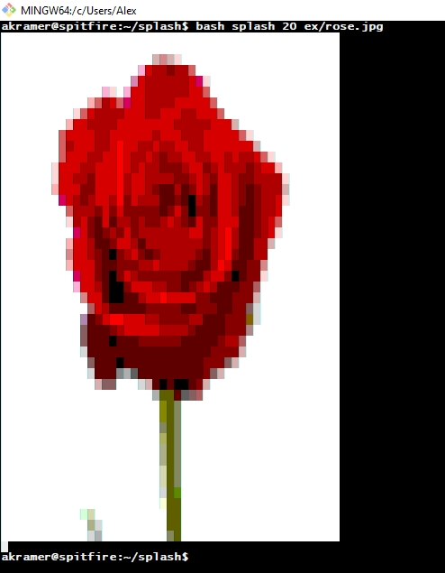

# Splash
A bash/python script to display an image in a terminal window.

## Requirements
Your terminal must support 256 colors. Additionally, Imagemagick and `bc` must be installed on your distribution. <strong> Python 2.x </strong> is required. It should work with any image format that Imagemagicks' `convert` supports.

## How it works
The smallest display element we have in a terminal is a single character. The unicode character █ (block) will fill up the entirety of a single character (using font `Lucida Console` at least). By printing many of these characters, issuing color change commands before each one, we can build up an image. The script will take an input image, scale it to an appropriate size, and print one █ for each pixel in the scaled image. The RGB color of each pixel is mapped to the closest color in the 256 color scale (using a helpful function by user MicahElliott).

## How to run it
`bash splash {% width} {image}`
(or `./splash ...`)

The first argument is the percentage of your terminal window you want the image to fill. For example, `50` would scale the image to 50% of the width of your terminal (at the time you run the command).

## Examples
`bash splash 20 ex/rose.jpg`

 

`bash splash 20 ex/dog.png`

 

`bash splash 100 ex/dog.png` (vertically composite image)

